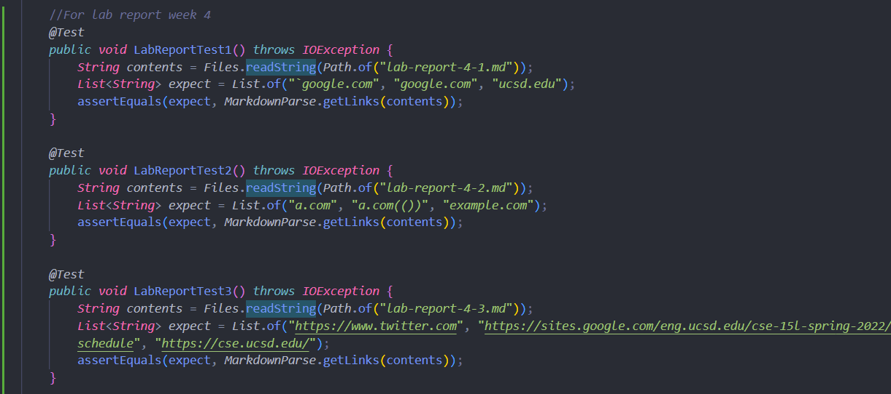
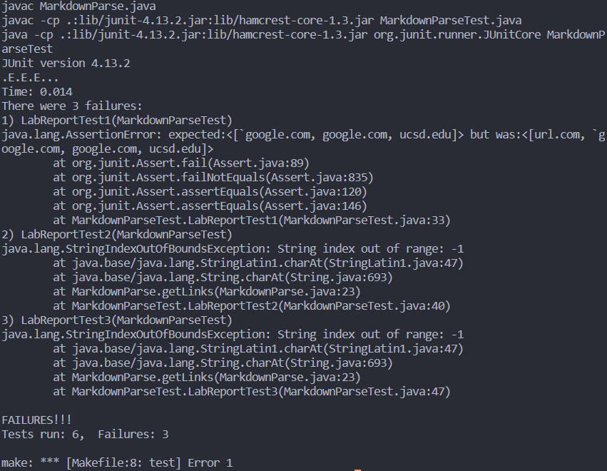

# [Lab Report 4: Debugging Implementations](https://jina-leemon.github.io/CSE15L/Lab_report_4/Lab_report_4)

### 1. Adding Tests to My + Someone Else's Implementation:
<br>
[**Link to my markdown-parse**](https://github.com/jina-leemon/markdown-parser) <br>
[**Link to someone else's markdown-parse**](https://github.com/TheJoeship/markdown-parser-fork)<br>

For each of the MarkeDownParseTest files, I added the following 3 tests for the three files:<br>



Each of the three files, "lab-report-4-1.md", "lab-report-4-2.md", "lab-report-4-3.md", has the following code:

**lab-report-4-1.md (Code Snippet 1)**
```
`[a link`](url.com)

[another link](`google.com)`

[`cod[e`](google.com)

[`code]`](ucsd.edu)
```
expected output: <br>
```["`google.com", "google.com", "ucsd.edu"]```

**lab-report-4-2.md (Code Snippet 2)**
```
[a [nested link](a.com)](b.com)

[a nested parenthesized url](a.com(()))

[some escaped \[ brackets \]](example.com)
```
expected output: <br>
```["a.com", "a.com(())", "example.com"]```

**lab-report-4-3.md (Code Snippet 3)**
```
[this title text is really long and takes up more than 
one line

and has some line breaks](
    https://www.twitter.com
)

[this title text is really long and takes up more than 
one line](
https://sites.google.com/eng.ucsd.edu/cse-15l-spring-2022/schedule
)


[this link doesn't have a closing parenthesis](github.com

And there's still some more text after that.

[this link doesn't have a closing parenthesis for a while](https://cse.ucsd.edu/


)

And then there's more text

```
expected output: 
```["https://www.twitter.com", "https://sites.google.com/eng.ucsd.edu/cse-15l-spring-2022/schedule", "https://cse.ucsd.edu/"]```

<br>
<br>
### 2. Outputs of Each Implementation
<br>
<br>
**My Implementation**
<br>
<br>


All the previous tests succeed, but the 3 new ones fail. 
Instead of the expected output, the three tests output:
>[url.com, `google.com, google.com, ucsd.edu]

>[a.com, a.com((, example.com]

>[
>    https://www.twitter.com
>, 
>https://sites.google.com/eng.ucsd.edu/cse-15l-spring-2022/schedule
, github.com
>
>And there's still some more text after that.
>
>[this link doesn't have a closing parenthesis for a while](https://cse.ucsd.edu/
>
>
>
>]

<br>
<br>
### 3. Changing The Code:
<br>
<br>
A small (<10 lines) code change that can make my program work:

<br>

**Code Snippet 1**

Do you think there is a small (<10 lines) code change that will make your program work for snippet 2 and all related cases that nest parentheses, brackets, and escaped brackets? If yes, describe the code change. If not, describe why it would be a more involved change.
Do you think there is a small (<10 lines) code change that will make your program work for snippet 3 and all related cases that have newlines in brackets and parentheses? If yes, describe the code change. If not, describe why it would be a more involved change

