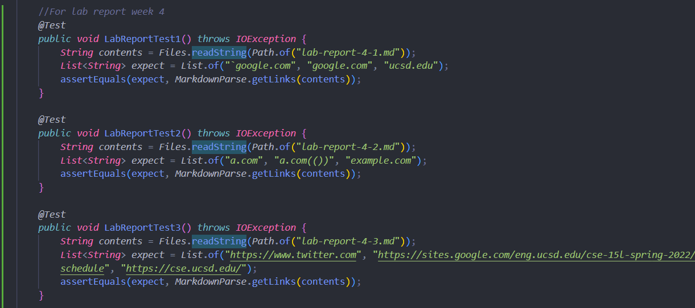
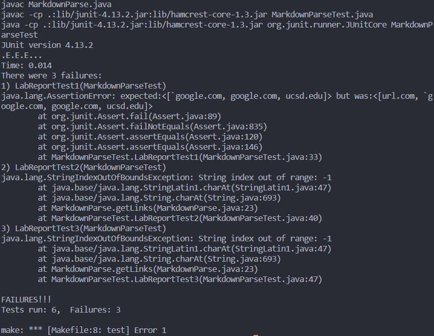
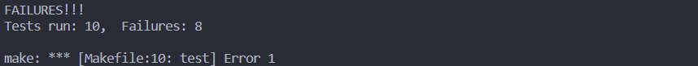
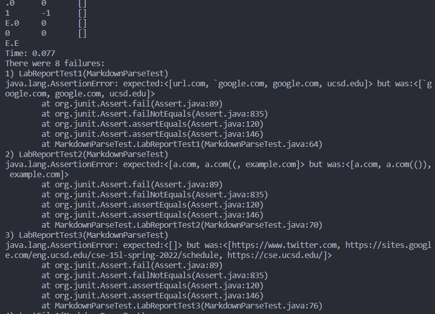
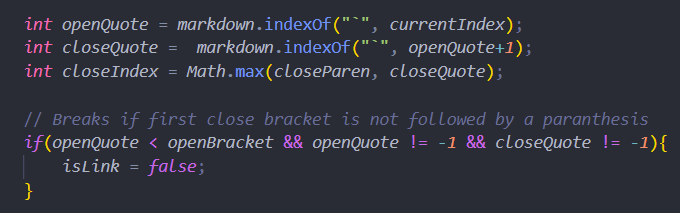
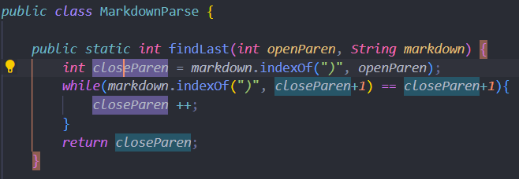
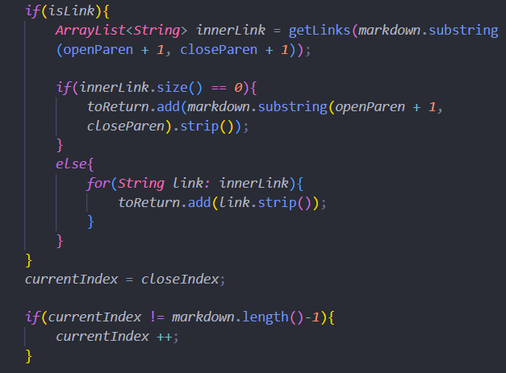
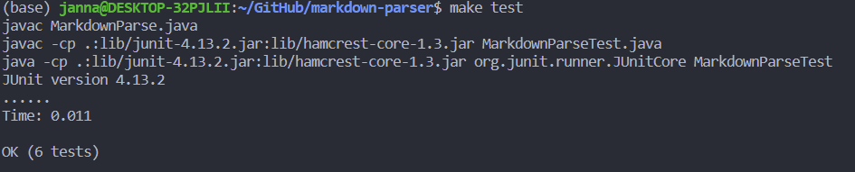

# [Lab Report 4: Debugging Implementations](https://jina-leemon.github.io/CSE15L/Lab_report_4/Lab_report_4)

### 1. Adding Tests to My + Someone Else's Implementation:
<br>
[**Link to my markdown-parse**](https://github.com/jina-leemon/markdown-parser) <br>
[**Link to someone else's markdown-parse**](https://github.com/TheJoeship/markdown-parser-fork)<br>

For each of the MarkeDownParseTest files, I added the following 3 tests for the three files:<br>



Each of the three files, "lab-report-4-1.md", "lab-report-4-2.md", "lab-report-4-3.md", has the following code:

**lab-report-4-1.md (Code Snippet 1)**
```
`[a link`](url.com)

[another link](`google.com)`

[`cod[e`](google.com)

[`code]`](ucsd.edu)
```
expected output: <br>
```["`google.com", "google.com", "ucsd.edu"]```

**lab-report-4-2.md (Code Snippet 2)**
```
[a [nested link](a.com)](b.com)

[a nested parenthesized url](a.com(()))

[some escaped \[ brackets \]](example.com)
```
expected output: <br>
```["a.com", "a.com(())", "example.com"]```

**lab-report-4-3.md (Code Snippet 3)**
```
[this title text is really long and takes up more than 
one line

and has some line breaks](
    https://www.twitter.com
)

[this title text is really long and takes up more than 
one line](
https://sites.google.com/eng.ucsd.edu/cse-15l-spring-2022/schedule
)


[this link doesn't have a closing parenthesis](github.com

And there's still some more text after that.

[this link doesn't have a closing parenthesis for a while](https://cse.ucsd.edu/


)

And then there's more text
```


expected output: 

```["https://www.twitter.com", "https://sites.google.com/eng.ucsd.edu/cse-15l-spring-2022/schedule", "https://cse.ucsd.edu/"]```

<br>
<br>

### 2. Outputs of Each Implementation
<br>

**My Implementation**
<br>
<br>


All the previous tests succeed, but the 3 new ones fail. 
Instead of the expected output, the three tests output:
>[url.com, `google.com, google.com, ucsd.edu]

>[a.com, a.com((, example.com]

>[
>    https://www.twitter.com
>, 
>https://sites.google.com/eng.ucsd.edu/cse-15l-spring-2022/schedule
, github.com
>
>And there's still some more text after that.
>
>[this link doesn't have a closing parenthesis for a while](https://cse.ucsd.edu/
>
>
>
>]

**Reviewed Implementation**
<br>
<br>




Previous implements including the new 3 fail.
Instead of the expected output, the three tests output:
>[url.com, `google.com, google.com, ucsd.edu]

>[a.com, a.com((, example.com]

>[]

<br>
<br>

### 3. Changing The Code:
<br>
<br>
A small (<10 lines) code change that can make my program work:

<br>

**Code Snippet 1** <br>
- **change:** The issue is that ` cancels out the markdown effect but simply getting the indices of the brackets and paranthesis does not ake this into account.
- A solution is to add variables openQuote and closeQuote that keeps track of where the quotes are, and check that openQuote is not smaller than openBracket if it exists within that substring of the markdown. Then set the isLink boolean variable to false (since this should not be a list)



**Code Snippet 2** <br>
- **change:** The problem is that the index of ")" is always the first one after the closeBracket index, when there may be more end paranthesis (for example, in snippet 2 a.com(())).
- A solution is to iterate until the next index of ")" is not an ")". <br> This way, the index of close paranthesis would be the last consecutive paranthesis.



**Code Snippet 3** <br>
- **change:** The issue is that the links include all the line breaks and everything between the paranthesis even if there's a link inside it.
- A solution is to use .strip to get rid of line breaks and redundant spaces. In addition, adding a getLinks method within getLinks can catch any inner links.



Now all the tests pass! I probably didn't actually have to debug it but I went all out

