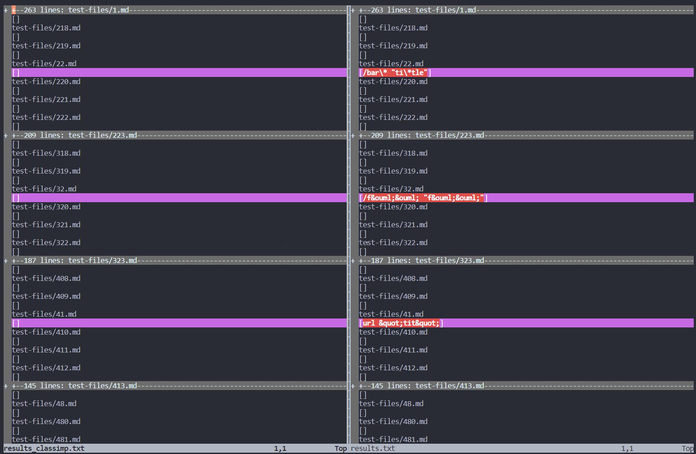
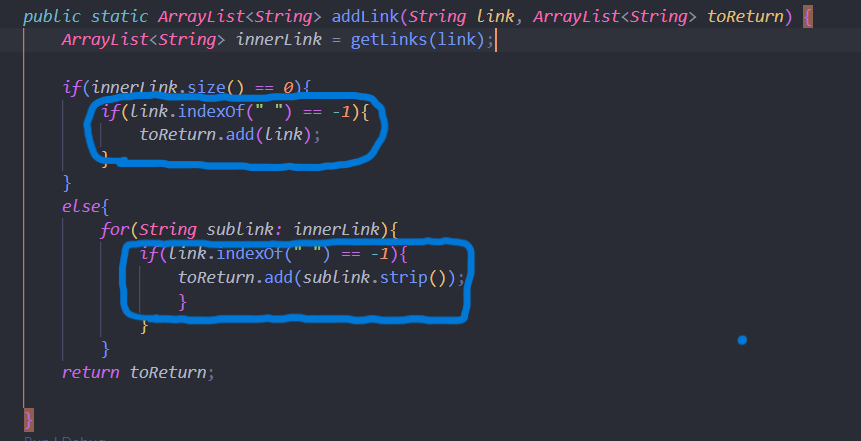
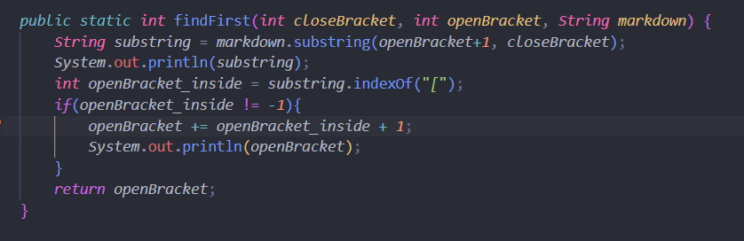

# [Lab Report 5: Debugging Implementations](https://jina-leemon.github.io/CSE15L/Lab_report_4/Lab_report_4)

## 1. Difference between output of tests:

left: class implementation, right: my implementation

I found the differences in outputs through vimdiff.



The different results are in [this github repo](https://github.com/jina-leemon/markdown-parser)
    results_classimp.txt: class implementation
    results.txt: my implementation

<br>

## 2. Difference 1:
```md
#test-files/41.md 
[a](url &quot;tit&quot;)
```
> classimp: []<br>
my implementation: [url &quot;tit&quot;]

correct implementation is the class one, since there should be no link here (also the output from commonmark demo).

**bug** <br>
A space should not be part of a link.<br>
In Commonmark, when the space between the url and quote is deleted, the text is recognized as a link.



For the fix, I added an if statement before adding the link to the ArrayList toReturn that checks there is no space within the link.
This prevents *url &quot;tit&quot;* from being asdded since there is a space.

<br>

## 3. Difference 2:
```md
#test-files/517.md 
[](/uri)
```
> classimp: [moon.jpg]<br>
my implementation: [moon.jpg]

both have the wrong implementation. The link here would be **/uri** (also the output from commonmark demo).
<br>

**bug** <br>
The code does not recognize that there is a picture object  within the brackets because it takes that first "[" and "]" from the beginning index. Therefore, it thinks [![moon] is the bracket part and therefore moon.jpg is the link.



For the fix, I added a findfirst method that finds the closest "[" before the first "]". Then (not depicted in the photo) I indicated that there was a sublink/ photo within and found the second "]" (the closing bracket after the current closing bracket).

This will detect that there is a sublink [...](/uri) and  and the code does not output anything for the second snippet because it is a pciture but /uri for the second one.
